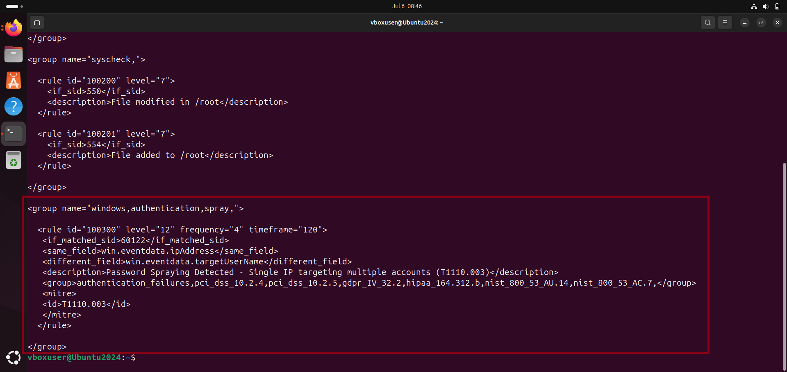
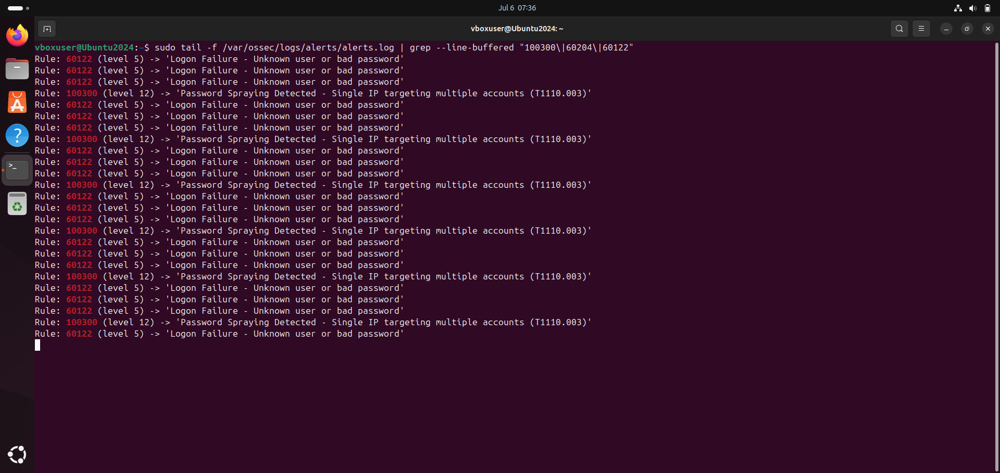
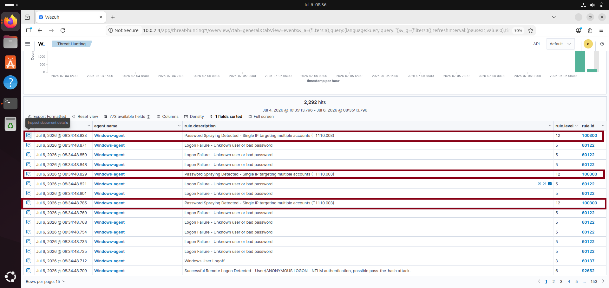
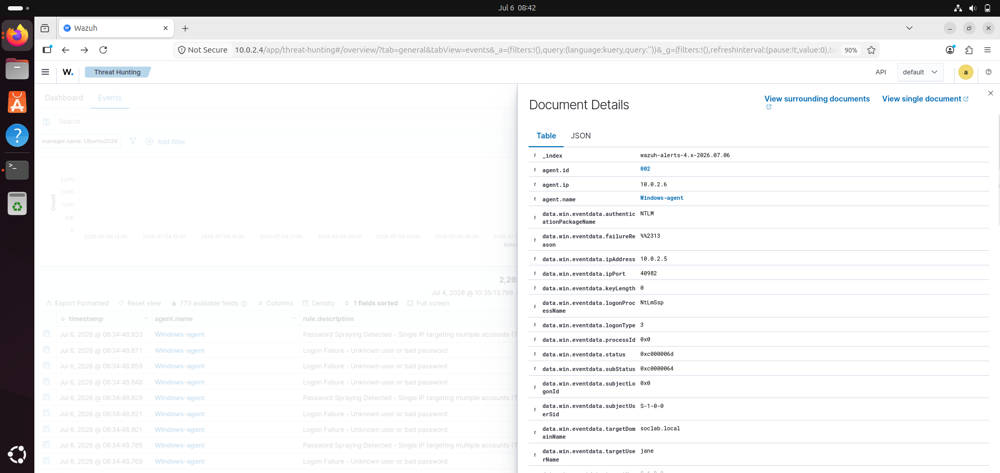

# wazuh-custom-detection-rules

# Wazuh Custom Detection Rule — Password Spray Detection

**Rule ID:** 100300  
**Level:** 12 (Critical)  
**MITRE ATT&CK:** T1110.003 — Brute Force: Password Spraying  
**Replaces gap in:** Rule 60204 — Multiple Windows Logon Failures  
**Outcome:** Custom rule built ✅ | Deployed and tested ✅ | Detection quality measured ✅

---

## The problem this rule solves

Rule 60204 — Wazuh's default brute force detection rule — fires the same level 10 alert whether one account or fifty accounts were targeted from the same IP. An analyst receiving that alert doesn't know whether to contain one account or investigate the entire domain. The response playbook for each scenario is completely different.

This custom rule closes that gap. Rule 100300 fires specifically when a single source IP targets **multiple different accounts** within a short time window — the defining characteristic of password spraying. It fires at level 12, two levels above the generic rule, and maps precisely to T1110.003 rather than the parent T1110 technique.

When Rule 100300 fires, the analyst immediately knows: this is a campaign-level threat requiring an environment-level response — not a single account containment task.

---

## What I built and why

This project came directly out of Project 4 findings. During the Active Directory attack simulation, Wazuh fired Rule 60204 during a password spray — the same rule it fires during RDP brute force. Same description. Same severity. No way to distinguish the two from the alert alone.

That ambiguity is dangerous in a real SOC. Brute force against one account means lock that account and investigate. Password spraying across a domain means assume multiple accounts may be compromised, check every account's bad password count, and treat it as a coordinated campaign.

The existing rule couldn't tell me which scenario I was facing. So I built one that could.

---

## Lab environment

| Machine | Role | IP |
|---|---|---|
| Ubuntu 24.04 + Wazuh Manager | SIEM — rule engine | 10.0.2.4 |
| Windows Server 2019 + AD DS + Wazuh Agent | Target endpoint | 10.0.2.6 |
| Kali Linux | Attack machine — spray simulation | 10.0.2.5 |

---

## The rule

```xml
<var name="SPRAY_FREQ">4</var>

<group name="windows,authentication,spray,">
  <rule id="100300" level="12" frequency="4" timeframe="120">
    <if_matched_sid>60122</if_matched_sid>
    <same_field>win.eventdata.ipAddress</same_field>
    <different_field>win.eventdata.targetUserName</different_field>
    <description>Password Spraying Detected - Single IP targeting multiple accounts (T1110.003)</description>
    <group>authentication_failures,pci_dss_10.2.4,pci_dss_10.2.5,gdpr_IV_32.2,hipaa_164.312.b,nist_800_53_AU.14,nist_800_53_AC.7,</group>
    <mitre>
      <id>T1110.003</id>
    </mitre>
  </rule>
</group>
```


*Rule 100300 as written in /var/ossec/etc/rules/local_rules.xml — the custom rules file that persists across Wazuh updates*

---

## How the rule works

Every element is deliberate:

**`if_matched_sid: 60122`** — watches for Rule 60122 (Logon Failure) to fire first. Our rule only activates when an individual logon failure is already confirmed. This prevents false positives from non-authentication events.

**`same_field: win.eventdata.ipAddress`** — groups events by source IP. All failures must come from the same attacker address. This is the same logic Rule 60204 uses.

**`different_field: win.eventdata.targetUserName`** — this is what Rule 60204 is missing. It tracks that the target username is changing across events. When the same IP hits `administrator`, then `jsmith`, then `jdoe`, then `svc_sql` — this condition fires. When the same IP hits `administrator` eight times — it doesn't.

**`frequency="4" timeframe="120"`** — fires after 4 different usernames are hit within 120 seconds. Calibrated for this lab environment. See the recalibration table below for production sizing.

**`level="12"`** — two levels above Rule 60204's level 10. Ensures spray alerts surface above the generic brute force noise in dashboard triage.

**`T1110.003`** — precise MITRE sub-technique mapping. Not the generic T1110 that covers all brute force types, but specifically password spraying. This matters for automated threat intelligence correlation and compliance reporting.

---

## The rule chain

Understanding how this rule sits inside Wazuh's detection hierarchy is essential for troubleshooting. If any parent rule fails to fire, Rule 100300 will never trigger regardless of how correctly it's written.

```
60000 — decoded_as: windows_eventchannel (root — agent pipeline only)
  └─ 60001 — win.system.channel = Security
      └─ 60104 — win.system.severityValue = AUDIT_FAILURE
          └─ 60105 — win.system.eventID = 4625
              └─ 60122 — eventID = 4625 (refined logon failure)
                  └─ 100300 — same IP, different username (our rule)
```

**Critical note on testing:** Rule 60000 requires `decoded_as: windows_eventchannel` — an internal decoder designation assigned by the Wazuh agent pipeline, not a field in the event data. This means `wazuh-logtest` cannot validate this rule chain. The decoder designation only exists when events arrive through a real Windows Wazuh agent. The only valid test is a live spray against a connected Windows endpoint.

---

## Deployment

Custom rules in Wazuh go in `/var/ossec/etc/rules/local_rules.xml` — never in the default ruleset at `/var/ossec/ruleset/rules/`. The default ruleset is overwritten on every Wazuh update. Local rules survive updates.

```bash
# Edit the custom rules file
sudo nano /var/ossec/etc/rules/local_rules.xml

# Validate XML syntax (basic check)
sudo python3 -c "import xml.etree.ElementTree as ET; ET.parse('/var/ossec/etc/rules/local_rules.xml'); print('XML syntax valid')"

# Restart manager to load new rules
sudo systemctl restart wazuh-manager

# Confirm rule loaded
sudo grep "100300" /var/ossec/logs/ossec.log
```

---

## Testing and validation

### Live spray simulation

Password spray executed from Kali using netexec against the domain controller:

```bash
nxc ldap 10.0.2.6 -u ~/ad_users.txt -p 'Password1' --continue-on-success 2>/dev/null
nxc ldap 10.0.2.6 -u ~/ad_users.txt -p 'Welcome1' --continue-on-success 2>/dev/null
```

### Rule 100300 firing in real time


*Live alert stream showing Rule 100300 (level 12) firing repeatedly alongside Rule 60122 (level 5) individual failures — the spray pattern is visually clear*

### Dashboard confirmation


*Wazuh Threat Hunting dashboard showing Rule 100300 at level 12 — higher severity than the surrounding level 5 individual failure alerts*

### Event detail — attacker attribution


*Document details confirming attacker IP 10.0.2.5 (Kali), target domain soclab.local, logon type 3 (network), and NTLM authentication — all key forensic fields preserved in the alert*

---

## Detection quality measurement

| Metric | Result |
|---|---|
| Total Rule 100300 firings | 12 |
| True positives | 12 |
| False positives | 0 |
| False positive rate | 0% |
| Real-time detection rate | 100% (when manager running) |

**Rule 100300 vs Rule 60204 — the key difference:**

| | Rule 60204 | Rule 100300 |
|---|---|---|
| Level | 10 | 12 |
| MITRE | T1110 (generic) | T1110.003 (specific) |
| Fires when | 8 events, same IP | 4 different usernames, same IP |
| Distinguishes spray from brute force | ❌ No | ✅ Yes |
| Response guidance | Ambiguous | Environment-level campaign |

**Operational finding — delayed detection during manager downtime:**

During testing, the Wazuh manager was offline for 5 minutes while events queued on the Windows agent. When the manager restarted, Rule 100300 correctly fired on the queued events — but with a 5-minute delay. In a real SOC environment, SIEM unavailability creates detection gaps that cannot be closed in real time. Manager health monitoring is not optional.

---

## Recalibration for production environments

The `frequency` and `timeframe` values in this rule are calibrated for a small lab domain with 4 user accounts. Production environments require different thresholds:

| Environment | Accounts | Recommended frequency | Recommended timeframe |
|---|---|---|---|
| Small lab | < 10 | 4 | 120 seconds |
| Small business | 10 — 100 | 8 | 120 seconds |
| Mid-size enterprise | 100 — 1,000 | 15 | 60 seconds |
| Large enterprise | 1,000+ | 20 | 60 seconds |

Note: as environment size increases, tighten the timeframe rather than just raising the threshold. In large environments, legitimate scattered failures are more common — a tighter time window catches automated spray tools while surviving normal authentication noise.

---

## What comes next

**Option B — Kerberos enumeration detection:**
The gap identified in Project 4 where Kerbrute username enumeration left zero Windows events requires an audit policy change before any detection rule can work. Enabling `Audit Kerberos Authentication Service` under Advanced Audit Policy creates the event stream — then a custom Wazuh rule can correlate multiple AS-REQ failures from external IPs into an enumeration alert.

**Option C — Authenticated AD enumeration detection:**
Build a Wazuh rule that fires when a single account generates multiple Event ID 4662 (directory object access) events against sensitive groups — Domain Admins, Enterprise Admins, Schema Admins — within a short window. Currently these events log silently with no alert.

---

## Repository structure

```
wazuh-custom-detection-rules/
├── README.md                          ← You are here
├── rules/
│   └── local_rules.xml               ← The actual rule file deployed on Wazuh
├── evidence/
│   └── detection_quality.txt         ← Full detection quality measurement
└── screenshots/
    ├── 01_rule_100300_firing.png      ← Live alert stream — rule firing in real time
    ├── 02_rule_100300_dashboard.png   ← Wazuh dashboard confirmation
    ├── 03_rule_100300_event_detail.png ← Event detail with attacker attribution
    └── 04_custom_rule_xml.png         ← Rule as written in local_rules.xml
```

---

## MITRE ATT&CK mapping

| Technique | ID | What was detected |
|---|---|---|
| Brute Force: Password Spraying | T1110.003 | Single IP targeting 4+ different domain accounts within 120 seconds |

---

*Project 5 of 10 — SOC Home Lab Detection Series*  
*By Paul Chinonso Obinze | [LinkedIn](https://www.linkedin.com/in/paul-obinze-217a00287/?lipi=urn%3Ali%3Apage%3Ad_flagship3_profile_view_base_contact_details%3BrbhSsMZvQOii6U3LETvQ) 
*Previous: [Project 4 — Active Directory Attack Detection](https://github.com/Nonso-cybersec/active-directory-attack-detection)*
